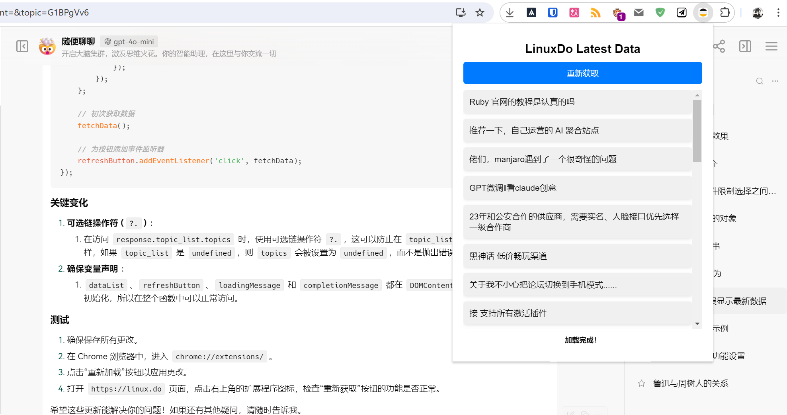

## LinuxDo Latest Data

> 功能：在浏览器右上角获取最新话题。

只支持 chrome 浏览器。

这是一个纯 AI 生成的项目，90% 的代码通过 chatGPT 生成。

跨域问题还没解决好，必须在浏览器保留一个 linuxdo 的页面，这时候去其他页面都可以使用。

所以这是一个练手的项目，不算正式产品，所以也未上架到谷歌应用商店，纯本地项目。

## 使用

下载仓库，然后把文件夹拖拽到扩展程序中，即可使用。

